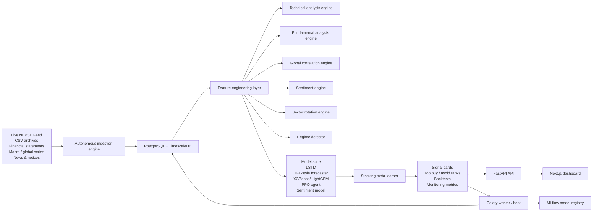

# Autonomous NEPSE Intelligence Architecture

## Diagram

## Runtime layout

- `backend/autonomous/ingestion.py`
  Loads local archives, live snapshots, macro series, and news into the database.
- `backend/autonomous/storage.py`
  Defines Timescale-ready persistence models for bars, fundamentals, macro series, predictions, and backtests.
- `backend/autonomous/features.py`
  Builds the cross-sectional feature matrix and scores fundamentals, regimes, and global linkages.
- `backend/autonomous/indicators.py`
  Computes RSI, MACD, Bollinger Bands, EMAs, ADX, Stochastic, Ichimoku, OBV, VWAP, Fibonacci levels, support/resistance, and chart patterns.
- `backend/autonomous/models.py`
  Hosts the multi-model ensemble and contextual meta-learner.
- `backend/autonomous/backtesting.py`
  Runs walk-forward ranking backtests for monitoring and retraining gates.
- `backend/autonomous/tasks.py`
  Schedules 15-minute market-hour cycles, 6-hour off-hour rescoring, daily outcome evaluation, and monthly retraining.

## Data flow

1. Raw market/fundamental/macro/news inputs land in TimescaleDB.
2. Feature engineering builds a 200+ feature matrix per stock with lagged market, sector, macro, and sentiment context.
3. The technical, fundamental, and global engines produce interpretable domain scores.
4. The model suite predicts 7-day, 30-day, and 90-day returns.
5. The meta-learner blends domain and model outputs into confidence-scored signal cards.
6. Prediction runs and later realized outcomes are stored for monitoring and retraining logic.

## Operating modes

- `Bootstrap mode`
  If historical archives are missing, the system seeds live bars and synthetic bootstrap history so the product remains usable.
- `Trained mode`
  Once local archives accumulate and the worker finishes a training cycle, the dashboard switches to the learned ensemble and stores versioned model metrics.

## Deployment notes

- Local development defaults to SQLite so the code can start without infrastructure.
- Docker Compose overrides the database to PostgreSQL + TimescaleDB and adds Redis, Celery, and MLflow.
- The autonomous API lives under `/api/autonomous/*`.
